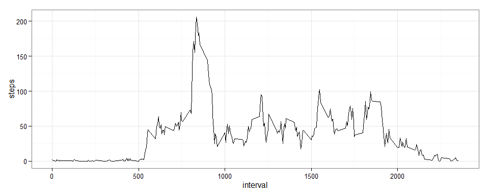
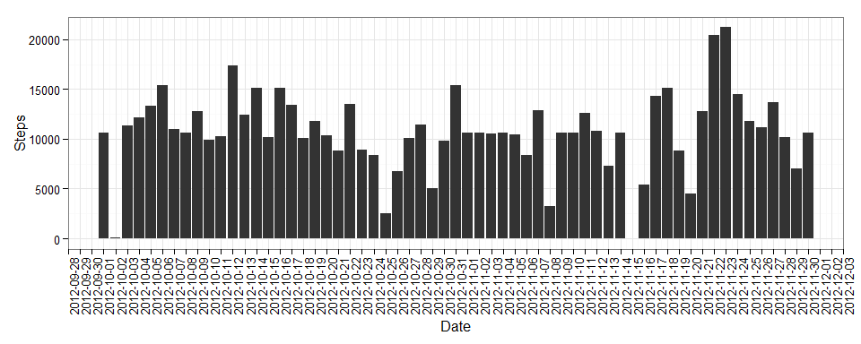
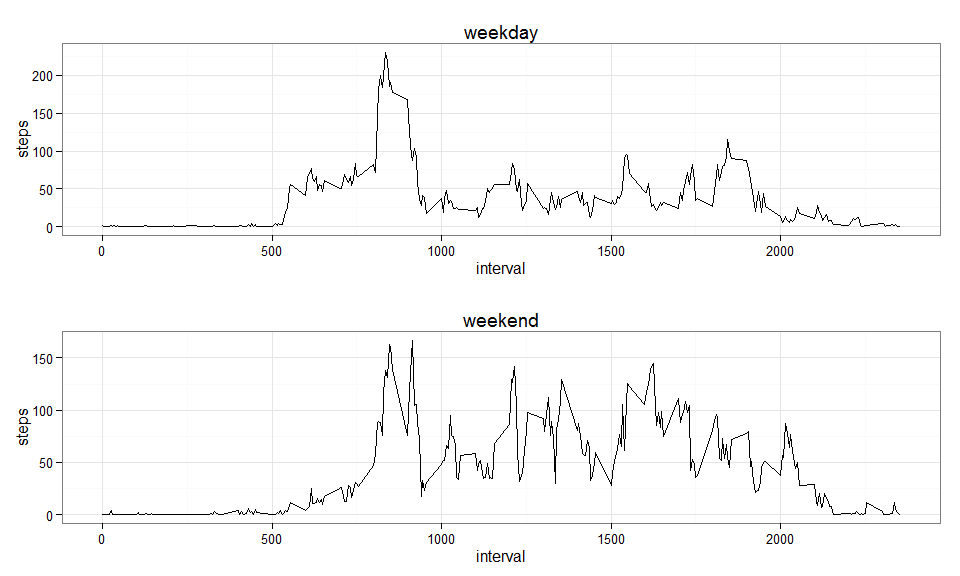

# Reproducible Research: Peer Assessment 1

## Initial setup

Firstly, we setup R locales to English and load necessary libraries for plots.


```r
Sys.setlocale("LC_TIME", "C")
library(ggplot2)
library(gridExtra)
```

## Loading and preprocessing the data

Secondly, we load the data, change a type of *date* attribute to *Date*.


```r
dt = read.csv("activity.csv")
dt$date = as.Date(dt$date)
```

Here is short summary of the data:


```r
summary(dt)
```

```
##      steps             date               interval     
##  Min.   :  0.00   Min.   :2012-10-01   Min.   :   0.0  
##  1st Qu.:  0.00   1st Qu.:2012-10-16   1st Qu.: 588.8  
##  Median :  0.00   Median :2012-10-31   Median :1177.5  
##  Mean   : 37.38   Mean   :2012-10-31   Mean   :1177.5  
##  3rd Qu.: 12.00   3rd Qu.:2012-11-15   3rd Qu.:1766.2  
##  Max.   :806.00   Max.   :2012-11-30   Max.   :2355.0  
##  NA's   :2304
```

```r
head(dt)
```

```
##   steps       date interval
## 1    NA 2012-10-01        0
## 2    NA 2012-10-01        5
## 3    NA 2012-10-01       10
## 4    NA 2012-10-01       15
## 5    NA 2012-10-01       20
## 6    NA 2012-10-01       25
```

## What is mean total number of steps taken per day?

We aggregate steps per day, taking into account possible *NA*s in *step*
attribute


```r
steps_per_day = aggregate(dt$steps, 
                          by=list(date=dt$date), 
                          FUN=function(steps,...){sum(steps, na.rm=T,...)})
colnames(steps_per_day) = c("date", "steps")
head(steps_per_day)
```

```
##         date steps
## 1 2012-10-01     0
## 2 2012-10-02   126
## 3 2012-10-03 11352
## 4 2012-10-04 12116
## 5 2012-10-05 13294
## 6 2012-10-06 15420
```

After that we can plot number of steps per day.


```r
p = ggplot(steps_per_day, aes(x=date, y=steps)) + 
    geom_bar(stat="identity") +
    scale_x_date(breaks="1 day",
                 limits = c(min(steps_per_day$date), max(steps_per_day$date)) ) +
    ylab("Steps") + 
    xlab("Date") +
    theme_bw() + 
    theme(axis.text.x = element_text(angle=90))

print(p)
```

 

The mean and median total number of steps taken per day are reported below.


```r
mean(steps_per_day$steps)
```

```
## [1] 9354.23
```

```r
median(steps_per_day$steps)
```

```
## [1] 10395
```

## What is the average daily activity pattern?


```r
steps_per_interval = aggregate(dt$steps, 
                               by=list(interval=dt$interval), 
                               FUN=function(steps,...){
                                   #steps[is.na(steps)] = 0
                                   mean(steps,na.rm=T,...)
                                   })
colnames(steps_per_interval) = c("interval", "steps")

p = ggplot(steps_per_interval, aes(interval, steps)) + geom_line() + theme_bw()
print(p)
```

 


```r
steps_per_interval[which.max(steps_per_interval$steps),]$interval
```

```
## [1] 835
```

## Imputing missing values


```r
sum(is.na(dt$steps))
```

```
## [1] 2304
```


```r
dt_nona = dt

for (i in 1:nrow(dt_nona))
{
    row = dt_nona[i,]
    
    if (is.na(row$steps))
        dt_nona[i,"steps"] = floor(steps_per_interval[steps_per_interval$interval==row$interval,]$steps)
}
```


```r
steps_per_day_nona = aggregate(dt_nona$steps, 
                          by=list(date=dt_nona$date), 
                          FUN=function(steps,...){sum(steps, na.rm=F,...)})
colnames(steps_per_day_nona) = c("date", "steps")

p = ggplot(steps_per_day_nona, aes(x=date, y=steps)) + 
    geom_bar(stat="identity") +
    scale_x_date(breaks="1 day",
                 limits = c(min(steps_per_day_nona$date), max(steps_per_day_nona$date)) ) +
    ylab("Steps") + 
    xlab("Date") +
    theme_bw() + 
    theme(axis.text.x = element_text(angle=90))

print(p)
```

 


```r
mean(steps_per_day_nona$steps)
```

```
## [1] 10749.77
```

```r
median(steps_per_day_nona$steps)
```

```
## [1] 10641
```

## Are there differences in activity patterns between weekdays and weekends?


```r
dt_nona_wd = dt_nona
dt_nona_wd$daytype = ifelse(weekdays(dt_nona_wd$date) %in% c("Saturday", "Sunday"),
                                       "weekend",
                                       "weekday")
dt_nona_wd$daytype <- as.factor(dt_nona_wd$daytype)
```


```r
subs = dt_nona_wd[dt_nona_wd$daytype == "weekend", ]

subs_steps_per_interval = aggregate(subs$steps, 
                                  by=list(interval=subs$interval), 
                                  FUN=mean)
colnames(subs_steps_per_interval) = c("interval", "steps")

p1 = ggplot(subs_steps_per_interval, aes(interval, steps)) + 
    geom_line() + theme_bw()  + ggtitle("weekend")


subs = dt_nona_wd[dt_nona_wd$daytype == "weekday", ]

subs_steps_per_interval = aggregate(subs$steps, 
                                    by=list(interval=subs$interval), 
                                    FUN=mean)
colnames(subs_steps_per_interval) = c("interval", "steps")

p2 = ggplot(subs_steps_per_interval, aes(interval, steps)) + 
    geom_line() + theme_bw()  + ggtitle("weekday")

grid.arrange(p2, p1, nrow=2)
```

 
