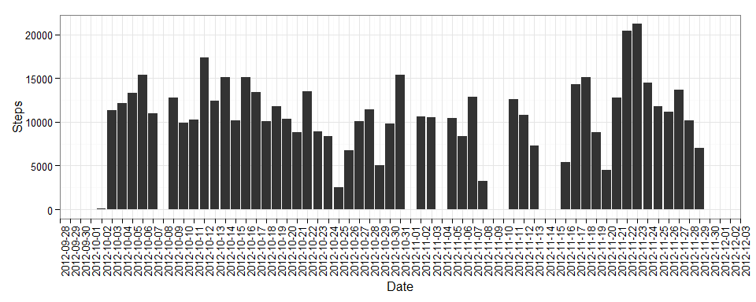
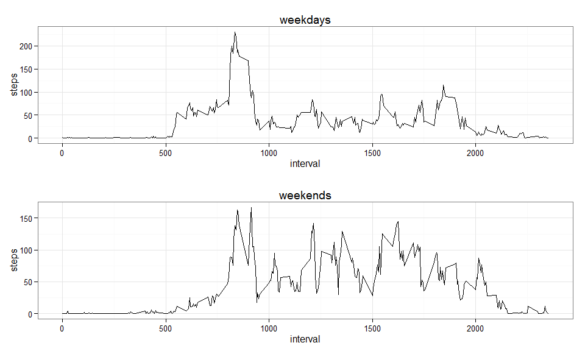

# Reproducible Research: Peer Assessment 1

## Initial setup

Firstly, we setup R locales to English and load necessary libraries for plots.


```r
Sys.setlocale("LC_TIME", "C")
library(ggplot2)
library(gridExtra)
```

## Loading and preprocessing the data

Secondly, we load the data, change a type of *date* attribute to *Date*.


```r
dt = read.csv("activity.csv")
dt$date = as.Date(dt$date)
```

Here is a short summary of the data:


```r
summary(dt)
```

```
##      steps             date               interval     
##  Min.   :  0.00   Min.   :2012-10-01   Min.   :   0.0  
##  1st Qu.:  0.00   1st Qu.:2012-10-16   1st Qu.: 588.8  
##  Median :  0.00   Median :2012-10-31   Median :1177.5  
##  Mean   : 37.38   Mean   :2012-10-31   Mean   :1177.5  
##  3rd Qu.: 12.00   3rd Qu.:2012-11-15   3rd Qu.:1766.2  
##  Max.   :806.00   Max.   :2012-11-30   Max.   :2355.0  
##  NA's   :2304
```

```r
head(dt)
```

```
##   steps       date interval
## 1    NA 2012-10-01        0
## 2    NA 2012-10-01        5
## 3    NA 2012-10-01       10
## 4    NA 2012-10-01       15
## 5    NA 2012-10-01       20
## 6    NA 2012-10-01       25
```

## What is mean total number of steps taken per day?

We aggregate number of steps per day, taking into account 
possible *NA*s in *step* attribute.


```r
steps_per_day = aggregate(dt$steps, 
                          by=list(date=dt$date), 
                          FUN=function(steps,...){sum(steps, na.rm=T,...)})
colnames(steps_per_day) = c("date", "steps")
head(steps_per_day)
```

```
##         date steps
## 1 2012-10-01     0
## 2 2012-10-02   126
## 3 2012-10-03 11352
## 4 2012-10-04 12116
## 5 2012-10-05 13294
## 6 2012-10-06 15420
```

After that we can plot number of steps per day.


```r
p = ggplot(steps_per_day, aes(x=date, y=steps)) + 
    geom_bar(stat="identity") +
    scale_x_date(breaks="1 day",
                 limits = c(min(steps_per_day$date), max(steps_per_day$date)) ) +
    ylab("Steps") + 
    xlab("Date") +
    theme_bw() + 
    theme(axis.text.x = element_text(angle=90))

print(p)
```

 

The mean and median total number of steps taken per day are reported below.


```r
mean(steps_per_day$steps)
```

```
## [1] 9354.23
```

```r
median(steps_per_day$steps)
```

```
## [1] 10395
```

## What is the average daily activity pattern?

Firstly, we aggregate an average number of steps per interval, 
taking into account possible *NA*s in *step* attribute.


```r
steps_per_interval = aggregate(dt$steps, 
                               by=list(interval=dt$interval), 
                               FUN=function(steps,...){
                                   mean(steps,na.rm=T,...)
                                   })
colnames(steps_per_interval) = c("interval", "steps")

head(steps_per_interval)
```

```
##   interval     steps
## 1        0 1.7169811
## 2        5 0.3396226
## 3       10 0.1320755
## 4       15 0.1509434
## 5       20 0.0754717
## 6       25 2.0943396
```

After that we can plot 5-minute intervals and the number of steps taken, 
averaged across all days.


```r
p = ggplot(steps_per_interval, aes(interval, steps)) + geom_line() + theme_bw()
print(p)
```

 

Following 5-minute interval, on average across all the days in the dataset,
contains the maximum number of steps:


```r
steps_per_interval[which.max(steps_per_interval$steps),]$interval
```

```
## [1] 835
```

## Imputing missing values

The total number of missing values (*steps* attribute) in the dataset 
is reported below:


```r
sum(is.na(dt$steps))
```

```
## [1] 2304
```

We crate a new data set: for each missing value we put a floored average value 
for this particular interval across all days.


```r
dt_nona = dt

for (i in 1:nrow(dt_nona))
{
    row = dt_nona[i,]
    
    if (is.na(row$steps))
        dt_nona[i,"steps"] = floor(steps_per_interval[steps_per_interval$interval==row$interval,]$steps)
}
```

We aggregate the new total number of steps taken each day...


```r
steps_per_day_nona = aggregate(dt_nona$steps, 
                          by=list(date=dt_nona$date), 
                          FUN=function(steps,...){sum(steps, na.rm=F,...)})
colnames(steps_per_day_nona) = c("date", "steps")

head(steps_per_day_nona)
```

```
##         date steps
## 1 2012-10-01 10641
## 2 2012-10-02   126
## 3 2012-10-03 11352
## 4 2012-10-04 12116
## 5 2012-10-05 13294
## 6 2012-10-06 15420
```

...and make a histogram.


```r
p = ggplot(steps_per_day_nona, aes(x=date, y=steps)) + 
    geom_bar(stat="identity") +
    scale_x_date(breaks="1 day",
                 limits = c(min(steps_per_day_nona$date), max(steps_per_day_nona$date)) ) +
    ylab("Steps") + 
    xlab("Date") +
    theme_bw() + 
    theme(axis.text.x = element_text(angle=90))

print(p)
```

 

The new mean and median total number of steps taken per day are reported below.


```r
mean(steps_per_day_nona$steps)
```

```
## [1] 10749.77
```

```r
median(steps_per_day_nona$steps)
```

```
## [1] 10641
```

Naturally, this numbers differ from the first part of the assignment. This
strategy of imputing data increases the new mean and median. The total
daily number of steps increases in cases where some intervals of a particual
day had missing values.

## Are there differences in activity patterns between weekdays and weekends?

We will work on the data without missing values. Firstly, we create a new
attribute *daytype* which indicates whether the given day was a weekday or a
weekend.


```r
dt_nona_wd = dt_nona
dt_nona_wd$daytype = ifelse(weekdays(dt_nona_wd$date) %in% c("Saturday", "Sunday"),
                                       "weekend",
                                       "weekday")
dt_nona_wd$daytype <- as.factor(dt_nona_wd$daytype)

head(dt_nona_wd)
```

```
##   steps       date interval daytype
## 1     1 2012-10-01        0 weekday
## 2     0 2012-10-01        5 weekday
## 3     0 2012-10-01       10 weekday
## 4     0 2012-10-01       15 weekday
## 5     0 2012-10-01       20 weekday
## 6     2 2012-10-01       25 weekday
```

Finally, we create a plot of 5-minute intervals and the number of steps 
taken, averaged across all weekday days or weekend days.


```r
# plot for weekends
subs = dt_nona_wd[dt_nona_wd$daytype == "weekend", ]

subs_steps_per_interval = aggregate(subs$steps, 
                                  by=list(interval=subs$interval), 
                                  FUN=mean)
colnames(subs_steps_per_interval) = c("interval", "steps")

p1 = ggplot(subs_steps_per_interval, aes(interval, steps)) + 
    geom_line() + theme_bw()  + ggtitle("weekends")

# plot for weekdays
subs = dt_nona_wd[dt_nona_wd$daytype == "weekday", ]

subs_steps_per_interval = aggregate(subs$steps, 
                                    by=list(interval=subs$interval), 
                                    FUN=mean)
colnames(subs_steps_per_interval) = c("interval", "steps")

p2 = ggplot(subs_steps_per_interval, aes(interval, steps)) + 
    geom_line() + theme_bw()  + ggtitle("weekdays")

# stack plots
grid.arrange(p2, p1, nrow=2)
```

 

As we can see, on average there is much more activity on weekends after 1000
interval, but less before 800 interval.
